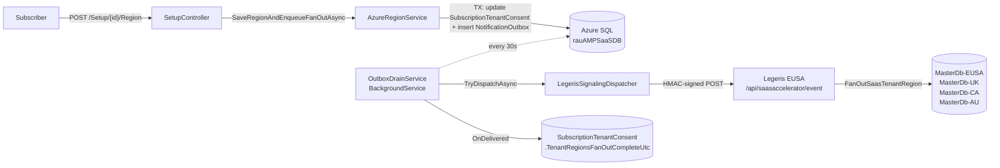

# Outbox / Legeris Signaling — Architecture

> **⚠️ Superseded for region fan-out (2026-06-13).** The **async transactional-outbox** path described below is **no longer used** for tenant-region propagation — nothing enqueues `TenantRegionFanOut` rows any more, so `OutboxDrainService` is dormant. Region propagation now works two ways:
> 1. **Detected region** → region is persisted and marked complete immediately; the regional `tenantregions` rows are propagated by the **external Legeris daily `SaaSInitialiseTenantRegions` reconcile job**, which *pulls* a snapshot from `ReconcileController` (`GET /api/saasaccelerator/reconcile-snapshot`). No push from this repo.
> 2. **Manually selected region** → `AzureRegionService.SaveRegionAndFanOutAsync` does a **synchronous immediate push** by calling `IOutboxDispatcher` directly (reusing the HMAC/HTTP dispatch below) and waiting — it does **not** persist an outbox row or use the drain.
>
> The HMAC signing + dispatch + receiver wire-protocol sections are still accurate for the synchronous push and as reference for any future event types. The **outbox table / drain / retry / dead-letter** sections are retained for history but are not on the live region path. See [RnU-Subscription-Setup-Flow-Brief.md](RnU-Subscription-Setup-Flow-Brief.md) §Step 2 for the current model.

Reference for the post-acceptance signaling path that pushes Marketplace-SaaS-side state changes (today: tenant-region assignment) into the Legeris EUSA service for cross-region fan-out.

> Scope: producers in this repo + the receiver in [Legeris.Office365.ServiceInterface](D:/VSTFSWork/Legeris%20for%20SharePoint/Legeris.Office365.ServiceInterface/Azure/SaasAcceleratorEventHandler.cs). End-to-end wire protocol, failure modes, and every App Service / web.config setting on both sides.

---

## 1. Purpose

When a customer completes Step 2 of the [Setup flow](../src/CustomerSite/Controllers/SetupController.cs) (region selection), that choice must be propagated to every regional MasterDb so the per-tenant runtime app can find the customer in its local DB. The propagation is cross-service (SaaS Accelerator → Legeris EUSA) and cross-region (Legeris EUSA → all regional MDBs), so it has to survive worker restarts, transient HTTP failures, and idempotent retries.

The mechanism is a **transactional outbox**: the producer writes the business-state change *and* the to-be-sent event in the same DB transaction. A background drain reads pending rows and pushes them to the downstream receiver with HMAC-signed payloads. The receiver records each event in its own idempotency log and performs the actual fan-out.

This pattern is also used for any *future* event types — the producer changes, the drain and dispatcher don't.

---

## 2. Components



| Component | Location | Role |
|---|---|---|
| **Producer** | [AzureRegionService](../src/Services/Services/AzureRegionService.cs) | Writes the consent row + outbox row in one transaction. Idempotency key prevents duplicate enqueues. |
| **Outbox store** | `NotificationOutbox` table (Azure SQL) | Durable queue with lease + retry metadata. |
| **Drain** | [OutboxDrainService](../src/CustomerSite/HostedServices/OutboxDrainService.cs) | `BackgroundService` in CustomerSite; leases pending rows, calls dispatcher, applies retry/dead-letter policy. |
| **Dispatcher** | [LegerisSignalingDispatcher](../src/Services/Services/LegerisSignalingDispatcher.cs) | HTTP client that signs the body and POSTs it. Returns `Delivered` / `Transient` / `Permanent`. |
| **Receiver** | [SaasAcceleratorEventHandler](D:/VSTFSWork/Legeris%20for%20SharePoint/Legeris.Office365.ServiceInterface/Azure/SaasAcceleratorEventHandler.cs) | ServiceStack handler on Legeris EUSA. Verifies HMAC, dedupes via `SaasEventLog`, dispatches by event type. |
| **Side effect** | `OnDelivered` hook in OutboxDrainService | When a `TenantRegionFanOut` row is marked delivered, stamps `TenantRegionsFanOutCompleteUtc` on the `SubscriptionTenantConsent` row. The Setup UI polls this flag to unlock Step 3. |

**Where the drain runs**: the hosted service is registered only in [CustomerSite/Startup.cs](../src/CustomerSite/Startup.cs#L210). AdminSite does not drain. If you scale CustomerSite to multiple instances, the lease window (`LeasedUntilUtc`) guarantees only one instance processes a given row at a time.

---

## 3. End-to-end sequence

```mermaid
sequenceDiagram
    autonumber
    participant U as Subscriber
    participant SC as SetupController
    participant ARS as AzureRegionService
    participant DB as NotificationOutbox<br/>+ SubscriptionTenantConsent
    participant OD as OutboxDrainService
    participant LSD as LegerisSignalingDispatcher
    participant LG as Legeris EUSA
    participant MDB as MasterDb-{region}

    U->>SC: POST /Setup/{id}/Region (azureRegion)
    SC->>ARS: SaveRegionAndEnqueueFanOutAsync
    activate ARS
    ARS->>DB: BEGIN TRAN
    ARS->>DB: UPDATE SubscriptionTenantConsent (AzureRegion, SelectedUtc, ...)
    ARS->>DB: INSERT NotificationOutbox (TenantRegionFanOut, idempotency key)
    ARS->>DB: COMMIT
    deactivate ARS
    SC-->>U: 302 → /Setup/{id} ("Propagating to all regions...")

    Note over OD: Every OutboxDrainIntervalSeconds (default 30s)
    OD->>DB: LeasePending (LeasedUntilUtc = now + 2 min)
    OD->>LSD: TryDispatchAsync(row)
    LSD->>LG: POST /api/saasaccelerator/event<br/>X-Signature: sha256=...<br/>X-Idempotency-Key: ...
    LG->>LG: VerifyHmac
    LG->>LG: SELECT SaasEventLog WHERE IdempotencyKey = ?
    alt First delivery
        par For each region in azRegions (parallel)
            LG->>MDB: UPSERT TenantRegion (TenantId, AzureRegion)
        end
        alt All regions succeeded
            LG->>LG: INSERT SaasEventLog
            LG-->>LSD: 200 {"status":"applied"}
        else Partial failure
            LG-->>LSD: 503 {"status":"partial-failure","failedRegions":[...]}
            Note over LSD,LG: Outbox retries on next drain pass.<br/>Dedup misses (no SaasEventLog row);<br/>fan-out re-runs; succeeded regions no-op.
        end
    else Duplicate (retry of an already-applied event)
        LG-->>LSD: 200 {"status":"already-applied"}
    end
    LSD-->>OD: Delivered
    OD->>DB: MarkDelivered (DeliveredUtc = now)
    OD->>DB: SubscriptionTenantConsent.TenantRegionsFanOutCompleteUtc = now

    Note over U: Setup UI status poll detects FanOutComplete → Step 3 unlocks
```

---

## 4. Database — `NotificationOutbox`

Defined by migration [20260515114604_AddSetupUxTables](../src/DataAccess/Migrations/20260515114604_AddSetupUxTables.cs). Lives in `rauAMPSaaSDB`.

| Column | Type | Notes |
|---|---|---|
| `Id` | int identity | PK |
| `EventType` | varchar(64) | Routing key (`TenantRegionFanOut` today) |
| `EventJson` | varchar(max) | Raw payload — body sent verbatim |
| `AmpSubscriptionId` | uniqueidentifier | Indexed; lets you query "events for sub X" |
| `IdempotencyKey` | varchar(255) | **Unique filtered** (`WHERE IS NOT NULL`); producer's de-dup guard |
| `Attempts` | int | Incremented by `MarkFailed` |
| `CreatedUtc` | datetime | Set by `Enqueue` |
| `NextAttemptUtc` | datetime | Drain filters on `<= now`; backoff updates this |
| `DeliveredUtc` | datetime | Set by `MarkDelivered` — also exits drain filter |
| `LastError` | varchar(2000) | Truncated |
| `LastResponseSnippet` | varchar(512) | Truncated for diagnostics |
| `DeadLettered` | bit | Excluded from `LeasePending` query |
| `LeasedUntilUtc` | datetime | Per-instance lease; expired leases re-enter the pool |

Indexes:
- `IX_NotificationOutbox_NextAttemptUtc` — drain ordering
- `IX_NotificationOutbox_IdempotencyKey` (unique filtered) — dedup guard
- `IX_NotificationOutbox_AmpSubscriptionId` — diagnostics

**Idempotency key shape** (producer side): `TenantRegionFanOut|{ampSubscriptionId:N}|{azureRegion}|{azureRegionSelectedUtc:O}`. Changing region or timestamp produces a different key, so a re-pick can re-fire.

---

## 5. Event types

Only one is wired up today. The receiver routes on `eventType` in the body, so adding more is producer-side work.

| EventType | Producer | Body fields (additional) | Receiver action |
|---|---|---|---|
| `TenantRegionFanOut` | `AzureRegionService.SaveRegionAndEnqueueFanOutAsync` | `assignedTenantId`, `azureRegion` | `FanOutSaasTenantRegionAsync` — upsert `TenantRegion` row in every `MasterDb{region}` in **parallel**. Partial failure → 503, no `SaasEventLog` write, sender's outbox retries. Per-region upserts are idempotent (check existing row before update). |
| _Subscribed_ (planned) | _none_ | _t.b.d._ | _t.b.d._ |
| _Unsubscribed_ (planned) | _none_ | _t.b.d._ | _t.b.d._ |
| _Suspended_ (planned) | _none_ | _t.b.d._ | _t.b.d._ |

Future producers follow the same recipe: build the payload, `outboxRepo.Enqueue(...)`, `SaveChangesAsync` — inside the transaction that commits the business-state change.

---

## 6. Wire protocol

POST to whatever `LegerisSignalingEndpointUrl` resolves to (= `/api/saasaccelerator/event` on the configured host).

**Headers** (set by [LegerisSignalingDispatcher](../src/Services/Services/LegerisSignalingDispatcher.cs)):
```
Content-Type: application/json; charset=utf-8
X-Signature:        sha256={lowercase hex of HMAC-SHA256(rawBody, secret)}
X-Event-Type:       {NotificationOutbox.EventType}
X-Idempotency-Key:  {NotificationOutbox.IdempotencyKey}
```

**Body** (verbatim from `NotificationOutbox.EventJson`):

```jsonc
{
  "eventType":          "TenantRegionFanOut",
  "saasSubscriptionId": "8a1f...uuid",
  "assignedTenantId":   "1b2c...uuid",
  "azureRegion":        "UK",
  "modifiedUtc":        "2026-05-15T14:23:01.0123456Z",
  "occurredBy":         "Accelerator",
  "actorUpn":           "user@example.com"
}
```

The receiver re-reads the **raw** request body (not a parsed-and-reserialised copy) for HMAC verification, so byte-for-byte preservation matters — don't post-process `EventJson` between enqueue and send.

### Response → outcome mapping (from [LegerisSignalingDispatcher.ClassifyResponse](../src/Services/Services/LegerisSignalingDispatcher.cs#L99))

| HTTP code | Outcome | Drain action | Notes |
|---|---|---|---|
| 200, 201, 202, 204 | **Delivered** | `MarkDelivered`, fire `OnDelivered` | Includes the receiver's `200 already-applied` (idempotent duplicate) and `200 applied` (full success) |
| 409 | **Delivered** | Idempotent duplicate; same as 200 | Reserved for genuine conflicts the sender should treat as already done |
| 408, 429, 5xx | **Transient** | `MarkFailed`; schedule retry per backoff | Includes `503 partial-failure` — receiver tells us some regions didn't apply; retry will hit the un-deduped path and re-run the idempotent upserts |
| Other 4xx | **Permanent** | `DeadLetter` (no retry) | Body validation errors, signature mismatch, etc. |
| Network/timeout/IO | **Transient** | `MarkFailed`; schedule retry | |

---

## 7. Failure & retry semantics

Backoff schedule (from [OutboxDrainService.BackoffSchedule](../src/CustomerSite/HostedServices/OutboxDrainService.cs#L30)):

```
Attempt #   Wait before next try
   1            30 s
   2             1 min
   3             2 min
   4             5 min
   5            15 min
   6            30 min
   7             1 hr
   8             2 hr
   9             4 hr
  10             8 hr
  11            12 hr
  12            24 hr
```

After `OutboxMaxAttempts` (default 12) the row is dead-lettered — same effect as a Permanent response. Diagnose, fix the cause, then manually retry via the admin Outbox page or SQL (see Ops Runbook below).

**Dead-letter triggers**:
- Receiver returns 401, 403, or any 4xx other than 408/429
- `LegerisSignalingEndpointUrl` is empty (Permanent at the dispatcher)
- Max attempts reached

**Stuck-but-not-yet-dead-lettered**: if the receiver is consistently 5xx, the row keeps retrying on the schedule above until attempt 12. That's ~52 hours from first attempt — fast enough for a same-day incident, slow enough not to hammer a broken downstream.

---

## 8. Settings reference

### 8.1. SaaS Accelerator — `rau-portal` App Service settings

| App Service Setting (`__` = `:`) | Type | Default | Required | Notes |
|---|---|---|---|---|
| `SaaSApiConfiguration__LegerisSignalingEndpointUrl` | URL | _(none)_ | **Yes** | Full URL incl. path. Without this, dispatcher returns `Permanent` and rows dead-letter on first attempt. |
| `SaaSApiConfiguration__LegerisSignalingHmacSecret` | string | _(none)_ | **Yes** | Base64-encoded 32 random bytes. **Reference from Key Vault.** |
| `SaaSApiConfiguration__OutboxMaxAttempts` | int | `12` | No | Max retries before dead-letter |
| `SaaSApiConfiguration__OutboxDrainIntervalSeconds` | int | `30` | No | Minimum 5 (clamped) |

**Bound at**: [CustomerSite/Startup.cs:83-88](../src/CustomerSite/Startup.cs#L83). Settings are *only* read on app start; change → restart (App Service restarts the worker automatically on Configuration save).

**The drain is only hosted in CustomerSite** — don't bother setting these on `rau-admin`. AdminSite needs the repo registrations (which it has) only so the admin Outbox UI works.

#### Concrete values for the dev environment (`rau`)

```powershell
# Generate, store, and reference the HMAC secret
$secret = [Convert]::ToBase64String([System.Security.Cryptography.RandomNumberGenerator]::GetBytes(32))
az keyvault secret set --vault-name rau-kv --name LegerisSignalingHmacSecret --value $secret

# Set on rau-portal
az webapp config appsettings set `
  -g rau-saas-commerial-marketplace-accelerator-dev `
  -n rau-portal `
  --settings `
    "SaaSApiConfiguration__LegerisSignalingEndpointUrl=https://<eusa-legeris-host>/api/saasaccelerator/event" `
    "SaaSApiConfiguration__LegerisSignalingHmacSecret=@Microsoft.KeyVault(VaultName=rau-kv;SecretName=LegerisSignalingHmacSecret)"

# Set on the Legeris EUSA app (same value)
az webapp config appsettings set `
  -g <legeris-rg> `
  -n <legeris-app> `
  --settings `
    "SaaSAcceleratorHmacSecret=@Microsoft.KeyVault(VaultName=rau-kv;SecretName=LegerisSignalingHmacSecret)"
```

Prereqs: both App Services must have a managed identity with **Key Vault Secrets User** on `rau-kv`. If the Legeris app is in a different KV, copy the secret there and reference its vault — the secret is portable, the KV name in the reference just needs to match the vault that holds it.

### 8.2. Legeris EUSA — web.config / App Service settings

The receiver reads settings via `WebConfigurationManager.AppSettings[...]` and connection strings via `ConfigurationManager.ConnectionStrings[...]`. In production these are overridden by App Service Configuration; in local dev they come from `web.config` (or a [side file](#9-local-dev)).

| Setting | Type | Required | Notes |
|---|---|---|---|
| `SaaSAcceleratorHmacSecret` | string | **Yes** | **Must equal** rau-portal's `SaaSApiConfiguration__LegerisSignalingHmacSecret`. If unset, the handler refuses every request — see [VerifyHmac](D:/VSTFSWork/Legeris%20for%20SharePoint/Legeris.Office365.ServiceInterface/Azure/SaasAcceleratorEventHandler.cs#L227). |
| `azRegion` | string | **Yes** | This instance's region (e.g. `EUSA`). Drives the LH/DEV isolation rule. |
| `azRegions` | csv | **Yes** | Regions to fan out to (e.g. `EUSA,UK,CA,AU`). Each must have a matching connection string. |

| Connection string | Required | Notes |
|---|---|---|
| `MasterDb{region}` | One per region in `azRegions` | Same convention as the ZoHo webhook. Missing connection strings are skipped + logged Critical (line 178). |

**Isolation rule** ([SaasAcceleratorEventHandler.cs:31-32](D:/VSTFSWork/Legeris%20for%20SharePoint/Legeris.Office365.ServiceInterface/Azure/SaasAcceleratorEventHandler.cs#L31)): if this instance is in `LH` or `DEV`, it fans out only to LH/DEV regions; otherwise only to non-LH/DEV regions. Prevents prod events leaking into dev databases when the regions list is mixed.

### 8.3. AzRSvc (multi-region lookup) — related but separate

This is the Function1 call the Setup page makes to ask "which region is this tenant in?" — *not* the Legeris signaling path. Listed here because both paths share configuration neighbourhood in `appsettings.json`.

| App Service Setting | Type | Default | Required | Notes |
|---|---|---|---|---|
| `SaaSApiConfiguration__AzRegionSvcUrlTemplate` | URL template | _(none)_ | _Yes if multi-region_ | Must contain `{region}` placeholder, e.g. `https://readandunderstoodazrsvc-{region}.azurewebsites.net/api/Function1` |
| `SaaSApiConfiguration__AzRegionSvcRegions` | csv | _(none)_ | _Yes if multi-region_ | `eusa,uk,ca,au` — shuffled per call |
| `SaaSApiConfiguration__AzRegionSvcUrl` | URL | _(none)_ | Legacy | Only used when Template+Regions are empty |
| `SaaSApiConfiguration__AzureRegionSelectorsFallback` | JSON | _(none)_ | No | Selector list shown when Function1 is unreachable |

Implemented at [AzureRegionService.GetTenantRegionAsync](../src/Services/Services/AzureRegionService.cs#L49). Ports the SPfx `GetAzureRegionUrl` failover algorithm.

---

## 9. Local dev

### 9.1. SaaS Accelerator (this repo) running locally

In `src/CustomerSite/appsettings.Development.json` (gitignored), populate the same keys:

```json
{
  "SaaSApiConfiguration": {
    "LegerisSignalingEndpointUrl": "https://localhost:<legeris-port>/api/saasaccelerator/event",
    "LegerisSignalingHmacSecret": "<the-base64-secret>",
    "OutboxDrainIntervalSeconds": 10
  }
}
```

`OutboxDrainIntervalSeconds = 10` makes the dev loop snappier; production stays at 30.

### 9.2. Legeris running locally

`@Microsoft.KeyVault(...)` doesn't resolve outside App Service. Use the **`appSettings` side-file pattern** (gitignored):

`web.config`:
```xml
<appSettings file="local-secrets.config">
  <add key="SaaSAcceleratorHmacSecret" value="" />
  <add key="azRegion" value="LH" />
  <add key="azRegions" value="LH,DEV" />
</appSettings>
```

`local-secrets.config` (gitignored, same folder):
```xml
<appSettings>
  <add key="SaaSAcceleratorHmacSecret" value="<the-base64-secret>" />
</appSettings>
```

When deployed to Azure, the side file isn't present and App Service Configuration (with KV references) takes over — no per-environment code paths.

### 9.3. Azure → local tunnels

If you need `rau-portal` (in Azure) to deliver to local Legeris, tunnel with ngrok:

```powershell
ngrok http --domain=<your-reserved>.ngrok-free.app --host-header=localhost <legeris-port>
```

Then set `SaaSApiConfiguration__LegerisSignalingEndpointUrl` on `rau-portal` to `https://<your-reserved>.ngrok-free.app/api/saasaccelerator/event`. The `--host-header=localhost` is required — ServiceStack/IIS Express will otherwise reject the binding.

---

## 10. Ops runbook

### Inspect outbox state

```sql
SELECT Id, EventType, AmpSubscriptionId, Attempts, DeadLettered,
       DeliveredUtc, LEFT(LastError, 200) AS LastError, NextAttemptUtc
FROM NotificationOutbox
WHERE DeliveredUtc IS NULL
ORDER BY Id DESC;
```

### Retry a dead-lettered row

**Preferred** — Admin UI: `https://rau-admin.azurewebsites.net/Outbox` → click **Retry** on the row.

**SQL alternative** (use when the admin UI is unavailable):

```sql
UPDATE NotificationOutbox
SET DeadLettered   = 0,
    Attempts       = 0,
    LastError      = NULL,
    LeasedUntilUtc = NULL,
    NextAttemptUtc = SYSUTCDATETIME()
WHERE Id = <row-id>;
```

### Inspect receiver-side delivery log

On Legeris EUSA's MDB (default master database):

```sql
SELECT TOP 50 IdempotencyKey, EventType, SaasSubscriptionId, AssignedTenantId,
       AzureRegion, ReceivedUtc, ModifiedUtc, Source
FROM SaasEventLog
ORDER BY ReceivedUtc DESC;
```

If an event shows in `NotificationOutbox.DeliveredUtc` but **not** in `SaasEventLog`, something replayed the request body without HMAC re-signing, or the receiver flushed without committing — both are unusual and worth a closer look at recent deploys.

### Common failure causes

| Symptom | Likely cause | Resolution |
|---|---|---|
| All rows dead-letter immediately with "LegerisSignalingEndpointUrl is not configured" | App Setting missing on `rau-portal` | Set it; restart not required (saving Configuration triggers a recycle); retry rows. |
| All rows transient with 401 | HMAC secrets diverged between sides | Compare KV values; rotate; retry. |
| Some rows deliver, some dead-letter as 400 | Body shape change broke validation | Check the most recent producer change; receiver requires `eventType`, `saasSubscriptionId`, `modifiedUtc` at minimum. |
| Rows deliver but `TenantRegionsFanOutCompleteUtc` doesn't populate | `OnDelivered` exception | Tail CustomerSite app logs — most likely a `consentRepo.Save` failure. |
| Receiver returns 200 but TenantRegion not written in some region | Connection string `MasterDb{region}` missing or unreachable | Check Legeris EUSA logs — handler logs each per-region failure as Critical. |

---

## 11. Reconciliation (safety net for the outbox path)

The outbox handles the *immediate* push of every region selection. Reconciliation is the daily safety net that catches anything the outbox missed — dead-lettered rows, manual MDB edits, fan-out bugs, schema migrations. It is symmetric with the existing ZoHo path: each Legeris region runs its own daily reconciler that *pulls* a snapshot from the SaaS Accelerator and diffs against its local MDB.

### Trigger

Lives entirely in Legeris, not the SaaS Accelerator. The SaaS path has its **own daily orchestrator** — `SaaSInitialiseSubscriptions` — separate from the ZoHo one so ZoHo can be retired independently. It self-gates with a 24-hour cache window in the same shape as `ZoHoInitialiseProduct`: the call is cheap when within the window, full reconciliation runs once per UTC day.

The two orchestrators are invoked **side-by-side** (not nested) from:
- `Program.Main` at WebJob startup (one warm call per service instance)
- `ProcessTenants_CronTrigger` every 15 min (catches a 24h gap without restart)

Each call is wrapped in its own `try/catch` so an outage on one provider's side cannot block the other's daily refresh. The SaaS-side timestamp is only advanced when the reconciliation call succeeds — a transient failure leaves the cache "expired" and the next cron tick retries.

When ZoHo is retired, the two ZoHo lines (`new ZoHoInitialiseProduct(...)` and any remaining `new ZoHoInitialiseTenantRegions()` callers) get deleted; the SaaS lines remain untouched. Today's `SaaSInitialiseSubscriptions` handler triggers `SaaSInitialiseTenantRegions`; future SaaS-only periodic work (subscription metadata cache, etc.) can chain off the same orchestrator without disturbing the SaaS file tree.

### SaaS Accelerator side — `GET /api/saasaccelerator/reconcile-snapshot`

Implemented in [ReconcileController](../src/AdminSite/Controllers/ReconcileController.cs) on **AdminSite** (not CustomerSite — operational, not customer-facing).

**Authentication**: HMAC-SHA256 over `"GET\n{path}\n{timestamp}"`, lowercase hex, presented in `X-Signature: sha256=...`. Replay prevented via `X-Signature-Timestamp` (epoch seconds, must be within ±5 min of server clock). Uses the same `LegerisSignalingHmacSecret` as the outbound push — one rotation rotates both directions.

**Response envelope**:
```jsonc
{
  "generatedUtc": "2026-05-15T09:32:14.873Z",
  "count":        47,
  "complete":     true,
  "tenants": [
    {
      "purchaserTenantId":  "1b2c3d4e-...",
      "azureRegion":        "EUSA",
      "ampSubscriptionId":  "8a1f...",
      "subscriptionStatus": "Subscribed",
      "modifiedUtc":        "2026-05-12T14:23:01.012Z"
    },
    /* ... */
  ]
}
```

**Source query**: `SubscriptionTenantConsent JOIN Subscriptions ON AmpSubscriptionId` filtered to `AzureRegion IS NOT NULL`. No status filter (Unsubscribed/Suspended tenants stay in the snapshot — MDBs only delete on subscription *deletion*, not unsubscribe). No region filter (each MDB tracks the full directory and filters client-side).

**Failure mode**: if the query throws partway through enumeration, the controller returns 500 with `{ complete: false, error: "..." }`. The reconciler treats this as "skip the DELETE phase this run" — INSERT/UPDATE still safe under partial data, DELETE-on-absence is not.

### Legeris side — `SaaSInitialiseTenantRegions` handler

Sibling of [ZoHoInitialiseTenantRegions](D:/VSTFSWork/Legeris%20for%20SharePoint/Legeris.Office365.ServiceInterface/ZoHoSubscriptions/ZoHoInitialiseTenantRegions.cs). Lives in [Legeris.Office365.ServiceInterface/Azure/SaaSInitialiseTenantRegionsHandler.cs](D:/VSTFSWork/Legeris%20for%20SharePoint/Legeris.Office365.ServiceInterface/Azure/SaaSInitialiseTenantRegionsHandler.cs).

**Diff logic** (per region, against its own MDB, filtered to `SubscriptionProvider = MarketplaceSaaS`):

| Source-vs-MDB | Action |
|---|---|
| TenantId in source, missing from MDB | **INSERT** TenantRegion (Provider=MarketplaceSaaS, AzureRegion = source value) |
| TenantId in both, AzureRegion differs | **UPDATE** AzureRegion to source value |
| TenantId in source, MDB row exists with `Provider=ZoHoBilling` | **UPDATE** — take ownership: flip Provider to MarketplaceSaaS, set region. Handles Zoho→Marketplace migration via private offers. |
| TenantId in both, AzureRegion matches | No-op |
| TenantId only in MDB (Provider=MarketplaceSaaS), snapshot is `complete:true` | **DELETE** — subscription record has been deleted from the SaaS DB |
| TenantId only in MDB (Provider=MarketplaceSaaS), snapshot is `complete:false` | **No-op** — skip the DELETE phase entirely under partial data |

The DELETE predicate is belt-and-braces: `WHERE TenantId = X AND SubscriptionProvider = 'MarketplaceSaaS'` — refuses to touch a ZoHo row even if the in-memory filter slipped.

### Legeris-side AppSettings (per-region web.config / App Service Configuration)

| Setting | Required | Notes |
|---|---|---|
| `SaaSAcceleratorReconcileUrl` | Yes | Base URL of the SaaS Accelerator AdminSite (no trailing slash needed). Path is appended in code. E.g. `https://rau-admin.azurewebsites.net`. |
| `SaaSAcceleratorHmacSecret` | Yes | Same secret used for the inbound push path. KV-reference recommended (see §8.2). |

If `SaaSAcceleratorReconcileUrl` is empty the reconciler skips with a Warning — used for regions that haven't been wired up yet without breaking the daily orchestrator.

### What's *not* triggered by reconciliation

- ❌ Customer region selection → handled by the immediate fan-out via outbox
- ❌ Unsubscribe/Suspend → MDB keeps the row per your retention rule
- ❌ Region change → fan-out re-runs (new outbox row); reconciler catches it only if fan-out failed

The reconciler is a safety net. In steady state it produces zero changes — the success log line `inserts=0 updates=0 deletes=0` means the outbox is healthy. The day it produces a non-zero `inserts` or `updates` is the day something interesting is worth investigating.

## 12. Open work

- **No producer for Subscribed / Unsubscribed / Suspended** — the receiver's switch statement is ready, but nothing in this repo enqueues them yet. Implement alongside the relevant subscription state handlers in [Services/StatusHandlers/](../src/Services/StatusHandlers/) when these signals become required.
- **No dead-letter alerting** — failures are visible in the admin Outbox page and SQL but there's no automated push (email, monitoring). If outbox reliability becomes load-bearing, add an Application Insights alert on `OutboxDrainService` log severity ≥ Error.
- **Single drainer instance assumed for ordering** — `LeasePending` guarantees mutual exclusion per row, not global ordering. If a future event type cares about ordering relative to another (e.g., "unsubscribe must arrive after subscribe"), add explicit ordering at the receiver, not the sender.
