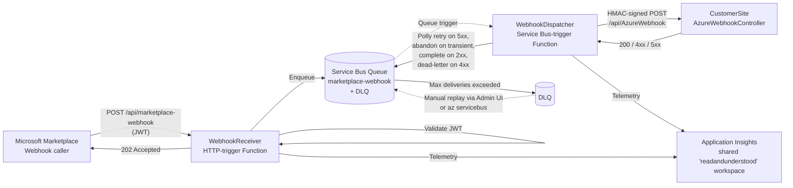
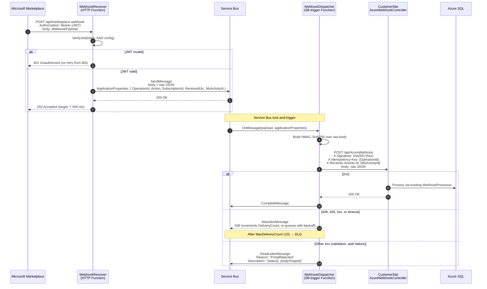

# Webhook Buffer Function App — Design

A consumption-plan Azure Function App that sits between the **Microsoft Commercial Marketplace** webhook caller and the SaaS Accelerator's existing [AzureWebhookController](../src/CustomerSite/Controllers/WebHook/AzureWebhookController.cs). The Function absorbs every Marketplace POST in well under Microsoft's tight delivery deadline, durably queues it, and then drives delivery to the portal with its own retry policy. The portal becomes free to be slow, recycled, scaled down, or briefly offline without the publisher losing webhook events.

> Status: **design only**. No code in this repo or the new project has been written yet. Section 11 enumerates the small set of changes the SaaS Accelerator needs once the buffer is built. Section 16 contains a self-contained brief you can paste into Claude in Visual Studio to scaffold the new project.

---

## 1. Why a buffer exists at all

Today, [AzureWebhookController.Post](../src/CustomerSite/Controllers/WebHook/AzureWebhookController.cs#L120) accepts the Marketplace POST, validates the JWT, runs [WebhookProcessor.ProcessWebhookNotificationAsync](../src/Services/WebHook/WebhookProcessor.cs#L51) inline, and only then returns 200. That inline work touches Azure SQL (subscription state, audit logs, application logs), the Marketplace Fulfillment API ([PatchOperationStatusResultAsync](../src/CustomerSite/WebHook/WebhookHandler.cs#L264) in some branches), and the outbox/notification path. Three failure modes follow from that:

1. **Cold start / app recycle** — if Microsoft's POST lands during a portal recycle, the call fails. Microsoft retries (see §3), but the publisher has no visibility and no manual recovery path.
2. **SQL throttling / DTU spike** — webhook calls bursting alongside customer traffic can blow the per-action processing time past Microsoft's ~10s deadline. Microsoft then retries the *same* event while the previous call may still be writing — duplicate processing risk.
3. **Outbound dependency stall** — `PatchOperationStatusResultAsync` on a slow Marketplace API call can hold the inbound HTTP request open, again pushing past Microsoft's deadline.

The portal does some of this already via the Legeris signaling outbox (see [Outbox-Signaling-Architecture](Outbox-Signaling-Architecture.md)), but that's an *outbound* outbox for events the portal originates. There is no *inbound* buffer between Microsoft and the controller. This document specifies one.

---

## 2. Components



| Component | Role | Notes |
|---|---|---|
| **WebhookReceiver** | HTTP-triggered Function. Validates JWT against AAD, enqueues raw body to Service Bus, returns `202` to Microsoft within a few hundred ms. | The *only* path Microsoft sees. Everything past this point is internal. |
| **Service Bus queue** | Durable transport with dead-letter, scheduled retry, and per-message lock semantics. Standard tier sufficient. | TTL = 14 days. MaxDeliveryCount = 10. |
| **WebhookDispatcher** | Service Bus-triggered Function. Reads message, calls portal `/api/AzureWebhook` with HMAC signature, applies Polly retry policy on 5xx and transient errors. | One worker per message lock; SB drives the parallelism. |
| **CustomerSite AzureWebhookController** | Existing controller (unchanged shape). Just receives the call from the Dispatcher instead of from Microsoft directly. Auth changes — see §11. | Idempotent re-processing of the same `OperationId` must be a no-op. |
| **Application Insights** | Single shared workspace (`readandunderstood`, USA_EAST — see [project memory](../docs/App-Reg-Monitoring.md)). | Correlate Receiver → Dispatcher → Portal via `operation_Id`. |

---

## 3. Microsoft's webhook timing and retry behavior

> **Verify these values against Microsoft Learn before relying on them in production.** The Marketplace SaaS Fulfillment webhook contract has changed before. The numbers below are what the current public docs and Microsoft's Marketplace SDK samples describe; treat them as ground truth for the design but re-check at implementation time.

| Aspect | Documented behavior |
|---|---|
| Acknowledgement deadline | The webhook endpoint must return `200`/`202` within ~10 seconds. Anything else (including a slow 200) is treated as a failed delivery. |
| Retry schedule | Approximate backoff: 10 s → 30 s → 1 min → 5 min → 10 min → 30 min → 1 hr → 2 hr → 4 hr → 8 hr → 24 hr |
| Total retry window | Up to ~14 days from the first attempt. After that the event is dropped from Microsoft's side. |
| Authoritative recovery | The publisher is expected to reconcile from `GET /subscriptions/{id}/operations` and `GET /subscriptions/{id}` — webhook is **at-least-once with bounded retries**, not guaranteed delivery. |
| What counts as failed | Timeout, non-2xx, connection refused, TLS handshake failure. |

Design consequences:

- The buffer's job is to **make the ACK fast and reliable**, not to replace Microsoft's retry. If the Function App is down too, Microsoft's own retries cover us up to ~14 days.
- The Dispatcher's retry schedule must be **finer-grained than Microsoft's** in the early minutes so transient portal blips don't escalate to long-tail backoff.
- Idempotency is non-negotiable downstream: Microsoft *will* deliver the same `OperationId` more than once during a long failure tail, and our buffer adds at-least-once semantics of its own.
- Reconciliation via `/operations` remains the safety net regardless of how good the buffer is — the buffer reduces the *probability* of needing it, never the requirement.

---

## 4. End-to-end sequence



The Receiver's only job is the orange box at the top. Everything past `SendMessage` is internal and asynchronous — Microsoft is no longer waiting.

---

## 5. Project layout

```
src/
└── SaaSAccelerator.WebhookBuffer/                  -- new .NET 8 isolated-worker Function App
    ├── SaaSAccelerator.WebhookBuffer.csproj
    ├── Program.cs                                  -- worker host, AI, HttpClient, options binding
    ├── Functions/
    │   ├── WebhookReceiver.cs                      -- [Function("WebhookReceiver")] HTTP POST
    │   └── WebhookDispatcher.cs                    -- [Function("WebhookDispatcher")] ServiceBusTrigger
    ├── Services/
    │   ├── IPortalClient.cs / PortalClient.cs      -- typed HttpClient + HMAC signing
    │   ├── IJwtValidator.cs / JwtValidator.cs      -- mirror of Services/Utilities/ValidateJwtToken.cs
    │   └── HmacSigner.cs                           -- shared with portal-side verifier
    ├── Options/
    │   ├── BufferOptions.cs                        -- queue name, max attempts, etc.
    │   ├── PortalOptions.cs                        -- base URL, HMAC secret, timeout
    │   └── AadOptions.cs                           -- tenantId, audience
    ├── host.json
    └── local.settings.json                         -- gitignored

src/SaaSAccelerator.WebhookBuffer.Tests/            -- xUnit + Moq
    ├── WebhookReceiverTests.cs                     -- happy path, bad JWT, missing body, SB write failure
    ├── WebhookDispatcherTests.cs                   -- 2xx/4xx/5xx classification, HMAC correctness
    └── PortalClientTests.cs

src/SaaSAccelerator.sln                             -- add both projects
```

The solution sits in the existing [src/SaaSAccelerator.sln](../src/SaaSAccelerator.sln) so `dotnet build` and `dotnet test` cover the whole product. Keep it in-repo (not a separate repo) — co-deployment and version drift are real risks otherwise.

---

## 6. Receiver function — `WebhookReceiver`

**Trigger**: `HttpTrigger(AuthorizationLevel.Anonymous, "post", Route = "marketplace-webhook")`

Authorization is **anonymous at the Functions level** because the contract Microsoft uses is JWT-bearer, not function keys. The Function performs JWT validation inline before enqueueing.

**Steps:**

1. Read raw body to a string. Preserve verbatim — the Dispatcher signs the exact bytes, identical to the [LegerisSignalingDispatcher](../src/Services/Services/LegerisSignalingDispatcher.cs) pattern in this repo.
2. Parse minimally — just `id` (OperationId), `action`, `subscriptionId`, `activityId` — for ApplicationProperties metadata and structured logging. The full body still goes through verbatim.
3. Validate JWT (`ValidateAudience`, `ValidateIssuerSigningKey`, `ValidateLifetime`, ClockSkew 0). Reuse the validation parameters from [ValidateJwtToken.cs:33](../src/Services/Utilities/ValidateJwtToken.cs#L33) so behavior matches exactly. On failure return `401`.
4. `await sbSender.SendMessageAsync(new ServiceBusMessage(rawBody) { ApplicationProperties = { ... }, MessageId = operationId })`. The `MessageId` enables Service Bus duplicate detection (§9).
5. Return `202` with no body. Latency target: **< 500 ms p99** including JWT validation.

**Failure handling at the Receiver:**

| Failure | HTTP response | Microsoft behavior |
|---|---|---|
| JWT invalid | 401 | Microsoft will not retry — correct outcome (we don't want bad-auth replays). |
| Service Bus send fails (throttling, outage) | 503 | Microsoft retries per §3. We rely on MS's retry to bridge SB outages. |
| Body unparseable | 400 | Microsoft will not retry. Log + AI alert. |
| AAD metadata endpoint unreachable | 503 | Same as above — bridge via MS retry. Cache OpenID config for 1 hour. |

**Why not function-key auth?** Microsoft cannot present a function key. JWT is the only auth the caller offers, and Microsoft signs the token with their tenant credentials per offer — we validate against `SaaSApiConfiguration.TenantId` and `SaaSApiConfiguration.Resource`, same values the portal already uses.

---

## 7. Dispatcher function — `WebhookDispatcher`

**Trigger**: `ServiceBusTrigger("%BufferOptions:QueueName%", Connection = "ServiceBusConnection")`

**Steps:**

1. Read message body (raw JSON) and ApplicationProperties.
2. Build HMAC-SHA256 over the body using `PortalOptions:HmacSecret`. Same wire shape as [LegerisSignalingDispatcher](../src/Services/Services/LegerisSignalingDispatcher.cs) — `X-Signature: sha256={lowercase hex}`.
3. POST to `{PortalOptions:BaseUrl}/api/AzureWebhook` with headers:
   - `Content-Type: application/json; charset=utf-8`
   - `X-Signature: sha256=...`
   - `X-Idempotency-Key: {OperationId}`
   - `X-Receiver-Activity-Id: {MsActivityId}` — preserves Microsoft's correlation id end-to-end
4. Classify the response (table below) and resolve the message.

**Response classification:**

| HTTP code | Outcome | SB action | Notes |
|---|---|---|---|
| 200, 201, 202, 204 | Delivered | `CompleteMessageAsync` | Happy path. |
| 408, 429 | Transient | `AbandonMessageAsync` | SB redelivers after lock expires. Polly does not retry inline — let SB do it so each attempt gets a fresh lock. |
| 5xx | Transient | `AbandonMessageAsync` | Same as above. |
| Network/timeout | Transient | Throw → SB abandons automatically | HttpClient timeout 8 s (short, deliberate). |
| 401, 403 | **Permanent** | `DeadLetterMessageAsync(reason="PortalAuthFailed")` | HMAC drift — alert and rotate. |
| Other 4xx | **Permanent** | `DeadLetterMessageAsync(reason="PortalRejected")` | Schema mismatch, validation failure. Diagnose, fix, manually replay from DLQ. |

**MaxDeliveryCount = 10** with default SB backoff (locks expire on abandon, redelivery is near-immediate; combine with Polly *inside* the dispatcher for a single retry on transient errors to absorb micro-blips without bumping DeliveryCount):

```
Inline Polly retry: 1 retry, 1 s delay (only on HttpRequestException or 5xx)
SB redelivery:     up to 9 more, lock-expiry-driven, ~1 min apart on Standard tier
```

This gives roughly 10 minutes of total retry budget before DLQ — well inside Microsoft's 14-day window if anything goes catastrophically wrong, but fast enough that a transient portal restart doesn't fill the DLQ.

---

## 8. Authentication from Dispatcher to Portal

Three options, recommendation **(a)**.

| Option | Pros | Cons |
|---|---|---|
| **(a) HMAC-signed body, shared KV secret** | Same pattern as Legeris signaling already in this repo. One secret to rotate. Stateless. Survives portal restarts. | Symmetric key in KV — needs careful rotation. |
| (b) Managed identity + Easy Auth on the portal | No secrets. Strong identity. | Easy Auth changes the portal's entire AuthN stack — touches AdminSite AAD sign-in too. Higher blast radius for a single endpoint. |
| (c) Function key | Trivially simple. | Function keys aren't meant for caller-side identity; rotation is awkward; doesn't bind to body. |

Going with (a). The portal adds a minimal HMAC verifier on the webhook endpoint **only**, mirroring what [SaasAcceleratorEventHandler.VerifyHmac](D:/VSTFSWork/Legeris%20for%20SharePoint/Legeris.Office365.ServiceInterface/Azure/SaasAcceleratorEventHandler.cs#L227) does on the Legeris side. The existing JWT validation path becomes obsolete for the buffered route (the Function did it already) — see §11.

---

## 9. Idempotency

Three layers, each pulling its weight:

1. **Service Bus duplicate detection** (queue-level, optional). Setting `MessageId = OperationId` and enabling duplicate detection with a 10-min window catches Microsoft re-delivering the same `OperationId` while the buffer is processing the first one. Cheap: just a queue property.
2. **Portal idempotency check** (downstream). The portal records `OperationId` in `ApplicationLog` already on first processing. The verifier should short-circuit a second arrival of the same `OperationId` with a fast 200 — needs a new index/table — see §11.
3. **Handler-level idempotency** (defence in depth). Existing handlers (e.g. [WebHookHandler.UnsubscribedAsync](../src/CustomerSite/WebHook/WebhookHandler.cs#L327)) already write idempotent updates (state transition + audit row). Double-runs are mostly harmless today but the audit log will show duplicates.

Recommend implementing all three. Layer (2) is the most user-visible (clean logs, no duplicate audit rows). Layer (1) is one queue setting. Layer (3) is the current accidental correctness — make it intentional.

---

## 10. Settings reference

### 10.1. WebhookBuffer Function App settings

| App Setting | Type | Default | Required | Notes |
|---|---|---|---|---|
| `BufferOptions__QueueName` | string | `marketplace-webhook` | No | Service Bus queue name |
| `BufferOptions__MaxDeliveryCount` | int | `10` | No | Mirror the queue's MaxDeliveryCount for diagnostics |
| `PortalOptions__BaseUrl` | URL | _(none)_ | **Yes** | e.g. `https://rau-portal.azurewebsites.net`. No trailing slash. |
| `PortalOptions__HmacSecret` | string | _(none)_ | **Yes** | Base64-encoded 32 random bytes. **Reference from Key Vault.** Same convention as `LegerisSignalingHmacSecret`. |
| `PortalOptions__TimeoutSeconds` | int | `8` | No | Per-request HTTP timeout |
| `AadOptions__TenantId` | guid | _(none)_ | **Yes** | Same as portal's `SaaSApiConfiguration:TenantId` |
| `AadOptions__Audience` | string | _(none)_ | **Yes** | Marketplace resource id — `20e940b3-4c77-4b0b-9a53-9e16a1b010a7` for the public cloud (see [CLAUDE.md](../CLAUDE.md)). |
| `ServiceBusConnection` | conn-string | _(none)_ | **Yes** | Connection string or `{namespace}.servicebus.windows.net` for managed identity. KV-referenced. |
| `APPLICATIONINSIGHTS_CONNECTION_STRING` | conn-string | _(none)_ | **Yes** | Shared `readandunderstood` workspace ([App-Reg-Monitoring.md](App-Reg-Monitoring.md)). Code-side AI **only** — do not enable the AI site extension (see project memory on the 500.30 trap). |

### 10.2. Azure resources to provision (dev environment `rau`)

| Resource | Name | Notes |
|---|---|---|
| Function App | `rau-webhook-buffer` | **Hosted on the existing `rau-asp` App Service Plan** alongside `rau-portal` and `rau-admin`. Windows, .NET 8 isolated. Zero marginal hosting cost — inherits the plan's existing VNet integration into `rau-vnet/web`. See §13 for the rationale and §17.4 for provisioning. |
| Service Bus namespace | `rau-sbns` | Standard tier (needed for DLQ + scheduled delivery). Premium not required. |
| Service Bus queue | `marketplace-webhook` | MaxDeliveryCount = 10, LockDuration = 1 min, EnableDeadLetteringOnMessageExpiration = true, RequiresDuplicateDetection = true (10-min window) |
| Storage Account | `rauwebhookbufferst` | Required by Functions runtime; lock down public access. |
| Key Vault entries | `WebhookBufferHmacSecret` and `WebhookBufferSbConnection` in existing `rau-kv` | First reused by the portal-side HMAC verifier; second is the Service Bus connection string the Function App reads via KV reference. |

Resource group is the existing dev RG (`rau-saas-commerial-marketplace-accelerator-dev`).

**Networking model.** The KV (`rau-kv`) is RBAC-authorised with `defaultAction: Deny` and a VNet rule allowing the `rau-vnet/web` subnet. There is no Private Endpoint on the KV — access stays on the public endpoint but is firewall-restricted to that subnet (and one IP allowlist entry for admin/CLI access). The Function App must be VNet-integrated into the same subnet to reach the KV; see §17.4 for the integration step.

---

## 11. Changes to *this* repo (SaaS Accelerator)

The buffer is mostly additive. The portal changes are narrow:

| Change | File | What |
|---|---|---|
| Add HMAC verification middleware/filter on the webhook endpoint | [AzureWebhookController.cs](../src/CustomerSite/Controllers/WebHook/AzureWebhookController.cs) | New `[ServiceFilter(typeof(BufferHmacFilter))]` or inline check at the top of `Post`. Re-read raw body before model binding (or use a custom binder) so the HMAC signs the exact bytes the buffer signed. |
| Reuse `HmacSigner` from the Legeris path | [LegerisSignalingDispatcher.cs](../src/Services/Services/LegerisSignalingDispatcher.cs) (existing) | Extract the HMAC helper to `Services/Utilities/HmacSigner.cs` so both directions and the Function project share one verifier. |
| Add idempotency short-circuit on `OperationId` | New table `WebhookOperationLog(OperationId PK, ReceivedUtc, ResultStatus)` or a check against existing `ApplicationLog` | First arrival processes normally and writes the row. Second arrival of the same `OperationId` returns 200 fast without re-running handlers. |
| Make `ValidateWebhookJwtToken` a no-op (or remove) for the buffered route | [AzureWebhookController.cs:126](../src/CustomerSite/Controllers/WebHook/AzureWebhookController.cs#L126) | JWT is validated at the Function. Double-validation against Microsoft's tenant would fail anyway — the caller (Function) doesn't present a Microsoft-signed JWT. Either remove or gate behind a `WebhookSource` header check. |
| Remove direct public exposure of `/api/AzureWebhook` | Azure portal / NSG / App Service IP restrictions | Once Microsoft is pointed at the Function App, restrict the portal endpoint to the Function App's outbound IP range (or use a VNet integration + Private Endpoint if the topology already has one). |
| Update the Marketplace offer's webhook URL | Partner Center — Offer setup | Switch from `https://rau-portal.azurewebsites.net/api/AzureWebhook` to `https://rau-webhook-buffer.azurewebsites.net/api/marketplace-webhook`. Reversible — keep the portal endpoint reachable through HMAC for the new path during cutover. |
| Document operations in [docs/](.) | This file + a link from [Installation-Instructions.md](Installation-Instructions.md) | Single index entry under "Optional production hardening". |

**Not changed:**

- [WebhookProcessor.cs](../src/Services/WebHook/WebhookProcessor.cs) — same handlers, same signatures.
- [WebHookHandler.cs](../src/CustomerSite/WebHook/WebhookHandler.cs) — all state-machine logic stays in the portal.
- [WebhookPayload.cs](../src/Services/WebHook/WebhookPayload.cs) — same DTO, same JSON contract.
- The outbox / Legeris signaling path — entirely orthogonal.

---

## 12. Observability

Correlate one webhook end-to-end across three components:

- **Receiver** logs `OperationId`, `Action`, `SubscriptionId`, `MsActivityId`, queue enqueue latency, JWT validation outcome.
- **Dispatcher** logs `OperationId`, `DeliveryCount`, portal HTTP status, response body snippet (truncated to 512 chars), inline-retry attempt count.
- **Portal** (existing `ApplicationLog`) already records `"The azure Webhook Triggered."` and serialized payload — add the inbound `X-Receiver-Activity-Id` to that log line so SQL queries can join to AI.

In Application Insights, set `operation_Id` on the Receiver from `MsActivityId` (cast to GUID) and propagate as `traceparent` to the portal. Then one Kusto query joins the full path:

```kusto
union requests, dependencies, traces
| where operation_Id == "<activityId>"
| project timestamp, name, resultCode, duration, cloud_RoleName, message
| order by timestamp asc
```

Alert on:
- DLQ message count > 0 (Service Bus metric) — anything in DLQ needs a human.
- Receiver p99 latency > 2 s — Microsoft's deadline is 10 s, but if we're at 2 s something is wrong.
- Dispatcher 4xx rate > 0 over 1 hr — schema drift or auth issue.

### 12.1. Telemetry cost posture

The Function App is configured to log only what's useful for operations. Service Bus listeners emit a `ReceiveBatchAsync start / done` trace every poll cycle by default — at idle that's ~30-60 events/min per receiver, ~40-80k events/day, ~3 MB of telemetry/day per receiver. Most of it is `Received 0 messages` from idle polls — operationally meaningless and not worth paying AI ingestion for.

[host.json](../src/WebhookBuffer/host.json) handles this with a "default-deny + opt-in" log level posture:

```jsonc
"logging": {
  "logLevel": {
    "default": "Warning",                                              // silence everything by default
    "Function": "Information",                                         // function lifecycle (start/end of each invocation)
    "Marketplace.SaaS.Accelerator.WebhookBuffer": "Information",       // your own ILogger calls
    "Host.Aggregator": "Error",                                        // suppresses periodic aggregator stats
    "Host.Results": "Warning"                                          // drops per-invocation timing line (kept failures)
  },
  "applicationInsights": {
    "samplingSettings": {
      "isEnabled": true,
      "maxTelemetryItemsPerSecond": 5,                                 // ingestion ceiling, cost safety net
      "excludedTypes": "Exception"                                     // never sample exceptions out
    },
    "enableLiveMetricsFilters": true
  }
}
```

What flows to Application Insights in steady state:
- One Function-lifecycle event per invocation (start + end of `WebhookReceiver` / `WebhookDispatcher`).
- Your own structured logs from [WebhookReceiver.cs](../src/WebhookBuffer/Functions/WebhookReceiver.cs) and [WebhookDispatcher.cs](../src/WebhookBuffer/Functions/WebhookDispatcher.cs) — the `Enqueued webhook OperationId=…` and `Webhook delivered Status=…` lines.
- All exceptions (sampling never drops these).
- HTTP request/response traces (auto-collected, sampled to 5/sec ceiling).

What gets silenced:
- Service Bus receiver poll traces (`ReceiveBatchAsync start/done`).
- WebJobs SDK housekeeping (host startup details, aggregator roll-ups, per-invocation result lines).
- Anything else under `Microsoft.*` or `Azure.*` at Information level.

#### Temporary debugging

If you need the poll traces back to diagnose a queue throughput issue, override the default for one category prefix via App Settings — no redeploy required:

```powershell
az functionapp config appsettings set -g $rg -n $funcApp `
  --settings "AzureFunctionsJobHost__logging__logLevel__marketplace-webhook=Trace"

# Revert when finished
az functionapp config appsettings delete -g $rg -n $funcApp `
  --setting-names "AzureFunctionsJobHost__logging__logLevel__marketplace-webhook"
```

The setting name follows the pattern `AzureFunctionsJobHost__logging__logLevel__<category-prefix>` — the SB receiver category starts with the queue name (`marketplace-webhook-{guid}-Receiver`), so `marketplace-webhook` matches by prefix.

---

## 13. Cost

Order-of-magnitude only. Webhook volume on a developer offer is single-digit per day; even production marketplace offers rarely exceed a few hundred per day per subscription.

### 13.1. Dev environment (`rau`)

The Function App rides on the **existing `rau-asp` App Service Plan** (Basic B1, Windows) — the same plan already paid for by `rau-portal` and `rau-admin`. Hosting marginal cost is **£0**.

| Resource | SKU | Marginal monthly |
|---|---|---|
| Function App on `rau-asp` | Shared B1 (already paid for) | £0 |
| Service Bus | Standard | ~£8 |
| Storage Account | Standard LRS | ~£1 |
| Application Insights | Shared `readandunderstood` workspace | < £1 with the log filter posture in §12.1 |

Total marginal cost added by the buffer: **~£9/month**.

Why not Consumption Plan? Consumption has no VNet integration, and `rau-kv` only allows access from the `rau-vnet/web` subnet — so Consumption can't reach the KV references. The shared App Service Plan inherits the portal's existing VNet integration, which is why the buffer can sit on it for free without any new networking plumbing.

### 13.2. Production sizing

Three realistic options. Webhook volume is not the driver — cold-start tolerance, VNet, deployment slots, and SLA are.

| Plan | Idle monthly | Cold start | VNet | SLA | Deployment slots | When to choose |
|---|---|---|---|---|---|---|
| **Shared App Service Plan** (same as dev, scaled up to Standard S1+) | £55-145 | None (Always On) | Inherits portal's | 99.95% (S1+) | 5 (S1) | Recommended if the portal already runs on Standard+/Premium. Buffer rides for free on existing capacity. |
| **Flex Consumption** (1 always-ready instance) | £70-115 | None | Yes (own subnet) | 99.95% | No | Recommended if the buffer needs CPU isolation from the portal, or the portal is on a SKU that can't share. |
| **Elastic Premium EP1** | £115 | None | Yes | 99.95% | 5 | Choose only if you need EP-specific features (long timeouts, durable functions, deployment slots) or operational consistency with other Functions already on EP. |
| **EP1 zone-redundant** | £345 | None | Yes | 99.99% | 5 | Compliance/HA requirement. |

For most prod deployments of this accelerator: **promote `rau-asp` to S1 (~£55/mo)** if it isn't already, and let the buffer share. That's the cheapest route to a proper SLA + Always On + deployment slots. The B1 plan in dev works fine but has no SLA and shares 1.75 GB RAM across three apps — too tight for production peace of mind.

### 13.3. Fixed costs that apply regardless of Function SKU

| Resource | Monthly |
|---|---|
| Service Bus Standard | £8 |
| Storage Account (LRS) | £1-2 |
| Key Vault | < £1 (operation-priced) |
| Application Insights ingestion | £1-5 with the filter posture in §12.1; £20+ without it |

Premium Service Bus is only worth considering if you need VNet integration on the SB side itself (not the same as VNet integration on the Function App) or strict sub-second queue p99 — neither applies for marketplace webhook volumes.

---

## 14. Local dev

`local.settings.json` (gitignored) on the Function side:

```json
{
  "IsEncrypted": false,
  "Values": {
    "AzureWebJobsStorage": "UseDevelopmentStorage=true",
    "FUNCTIONS_WORKER_RUNTIME": "dotnet-isolated",
    "ServiceBusConnection": "Endpoint=sb://rau-sbns.servicebus.windows.net/;SharedAccessKeyName=RootManageSharedAccessKey;SharedAccessKey=<dev-key>",
    "BufferOptions__QueueName": "marketplace-webhook",
    "PortalOptions__BaseUrl": "https://localhost:5001",
    "PortalOptions__HmacSecret": "<base64-shared-with-portal>",
    "PortalOptions__TimeoutSeconds": "8",
    "AadOptions__TenantId": "<tenant-guid>",
    "AadOptions__Audience": "20e940b3-4c77-4b0b-9a53-9e16a1b010a7",
    "APPLICATIONINSIGHTS_CONNECTION_STRING": "<dev-ai-conn-string>"
  }
}
```

Local loop:
1. `dotnet run --project src/CustomerSite` — portal on `https://localhost:5001`.
2. `func start` in `src/SaaSAccelerator.WebhookBuffer` — Functions host on `http://localhost:7071`.
3. POST a sample webhook to `http://localhost:7071/api/marketplace-webhook` with a valid Microsoft-issued test JWT (the Marketplace Partner Center has a "Test webhook" tool that does this).
4. Watch the message flow through the local Storage Emulator queue (if using Azurite) or a dev SB namespace into the portal.

For end-to-end testing with the real Microsoft test caller, expose the Function via ngrok and configure that URL in Partner Center → Offer → Technical configuration → Webhook URL.

---

## 15. Ops runbook

### Inspect queue state

```powershell
# Active vs DLQ message counts
az servicebus queue show `
  -g rau-saas-commerial-marketplace-accelerator-dev `
  --namespace-name rau-sbns `
  --name marketplace-webhook `
  --query "{active:countDetails.activeMessageCount, dlq:countDetails.deadLetterMessageCount, scheduled:countDetails.scheduledMessageCount}"
```

### Replay a DLQ message

**Preferred** — add a small Admin UI page mirroring the existing [Outbox replay](../src/AdminSite/Controllers/) UX. Pulls from `marketplace-webhook/$DeadLetterQueue`, displays headers + body, has a "Resend" button that re-enqueues to the live queue.

**CLI fallback** — use Service Bus Explorer in the Portal, or:

```powershell
# Move all DLQ messages back to the main queue
az servicebus queue update `
  -g rau-saas-commerial-marketplace-accelerator-dev `
  --namespace-name rau-sbns `
  --name marketplace-webhook `
  --enable-dead-lettering-on-message-expiration true
# (use Service Bus Explorer to resubmit individually — bulk replay needs care because the cause of dead-lettering must be fixed first)
```

### Common failure causes

| Symptom | Likely cause | Resolution |
|---|---|---|
| DLQ filling with `PortalAuthFailed` | HMAC secret drift between Function and portal | Compare KV values; rotate; replay DLQ. |
| Receiver returning 401 for all requests | AAD `TenantId` or `Audience` mismatch with what Microsoft signs | Verify the offer's listed Microsoft AAD tenant; align Function settings. |
| Receiver p99 > 2 s | Function cold-start, JWT validation slow path, AAD metadata fetch | Cache `OpenIdConnectConfiguration` for 1 hour; consider Premium plan if cold-start is the cause (rare at this volume). |
| Microsoft reports webhook delivery failures even though the Function shows 202 | Mismatch between the Function's URL and what Partner Center has stored | Re-check Partner Center webhook URL; confirm by tailing Function logs during a "Test webhook" call from Partner Center. |
| Portal sees duplicate `OperationId` processing | Idempotency check (§9 layer 2) not yet implemented | Implement layer 2; handler-level idempotency (layer 3) is already defensive but layer 2 keeps logs clean. |

### Recovery if the whole buffer is down

Microsoft's own retry window is the recovery channel — see §3. If the Function App is offline for less than ~14 days, no events are lost; they just queue up at Microsoft. Once the buffer is restored, Microsoft replays at its backoff cadence. If the outage exceeds Microsoft's window (which would be a major incident), reconcile from `GET /subscriptions/{id}/operations` for every active subscription.

---

## 16. Brief for Claude in Visual Studio — scaffold this project

> Paste this as a single message to Claude inside Visual Studio while the [Commercial-Marketplace-SaaS-Accelerator](.) repo is the active workspace.

```
Scaffold a new Azure Functions project to act as a buffer between Microsoft Commercial
Marketplace webhook calls and our existing CustomerSite/AzureWebhookController.

Constraints and conventions:
- .NET 8 isolated worker, Functions runtime v4. C# nullable enabled, file-scoped namespaces.
- Add the new project to the existing src/SaaSAccelerator.sln. Two projects: 
  src/SaaSAccelerator.WebhookBuffer (the Function App) and 
  src/SaaSAccelerator.WebhookBuffer.Tests (xUnit + Moq).
- The full design lives in docs/Webhook-Buffer-Function-App.md - read it first and follow it.
  In particular: §5 (project layout), §6 (Receiver), §7 (Dispatcher), §10 (settings shape).

Project: src/SaaSAccelerator.WebhookBuffer
  NuGet packages (use the latest stable in the 8.x range for ASP.NET / Functions packages):
    Microsoft.Azure.Functions.Worker
    Microsoft.Azure.Functions.Worker.Sdk
    Microsoft.Azure.Functions.Worker.Extensions.Http
    Microsoft.Azure.Functions.Worker.Extensions.Http.AspNetCore
    Microsoft.Azure.Functions.Worker.Extensions.ServiceBus
    Microsoft.Azure.Functions.Worker.ApplicationInsights
    Microsoft.ApplicationInsights.WorkerService
    Microsoft.Extensions.Options.ConfigurationExtensions
    Microsoft.IdentityModel.Protocols.OpenIdConnect
    System.IdentityModel.Tokens.Jwt
    Polly
    Polly.Extensions.Http

Files to create:

1. Program.cs - HostBuilder using ConfigureFunctionsWebApplication. Register:
   - Options binding for BufferOptions, PortalOptions, AadOptions (each binds from
     "BufferOptions" / "PortalOptions" / "AadOptions" config sections).
   - Singleton IJwtValidator with an internal 1-hour OIDC metadata cache.
   - Singleton HmacSigner (shared with the portal side - reads PortalOptions:HmacSecret).
   - Typed HttpClient for IPortalClient with PortalOptions:TimeoutSeconds, no automatic
     retry handler (Polly is applied explicitly inside the Dispatcher so we control SB
     interaction).
   - Application Insights with services.AddApplicationInsightsTelemetryWorkerService()
     and services.ConfigureFunctionsApplicationInsights().

2. Functions/WebhookReceiver.cs - [Function("WebhookReceiver")] on HttpTrigger
   (AuthorizationLevel.Anonymous, "post", Route = "marketplace-webhook"). Implements §6
   step list exactly: read raw body, parse minimal fields, validate JWT, send to SB with
   MessageId = OperationId, return 202 on success / 401 on bad JWT / 503 on SB failure /
   400 on unparseable body. Use ServiceBusClient and ServiceBusSender resolved from DI 
   (do NOT use the SB output binding - we need explicit MessageId and ApplicationProperties
   control, and we want to return 503 if SB write fails).

3. Functions/WebhookDispatcher.cs - [Function("WebhookDispatcher")] on
   ServiceBusTrigger("%BufferOptions:QueueName%", Connection = "ServiceBusConnection"),
   AutoCompleteMessages = false. Take ServiceBusReceivedMessage and ServiceBusMessageActions.
   Implements §7 step list and response classification table exactly. Inline Polly policy:
   single retry on HttpRequestException or 5xx after 1 second. Then:
     - 2xx -> CompleteMessageAsync
     - 408, 429, 5xx, timeout -> AbandonMessageAsync
     - 401, 403, other 4xx -> DeadLetterMessageAsync with reason/description

4. Services/IJwtValidator.cs + JwtValidator.cs - mirror the validation parameters from 
   src/Services/Utilities/ValidateJwtToken.cs:33-43 (ValidateAudience true, ValidateIssuer
   false, ValidateLifetime true, ClockSkew Zero, IssuerSigningKeys from the AAD OIDC
   metadata). Cache ConfigurationManager<OpenIdConnectConfiguration> for the lifetime
   of the singleton. After signature validation, also check that the 'azp' or 'appid'
   claim equals AadOptions.Audience (matching ValidateJwtToken.cs:65-72).

5. Services/IPortalClient.cs + PortalClient.cs - typed HttpClient. Single method:
   Task<HttpResponseMessage> PostAsync(string rawBody, string operationId, string activityId, CancellationToken ct).
   Builds HMAC over rawBody using HmacSigner, sets X-Signature / X-Idempotency-Key /
   X-Receiver-Activity-Id headers, POSTs to /api/AzureWebhook on PortalOptions.BaseUrl.

6. Services/HmacSigner.cs - static-ish helper. ComputeSignature(string body, byte[] key)
   returns lowercase hex of HMAC-SHA256(body, key). Mirror the signing in
   src/Services/Services/LegerisSignalingDispatcher.cs exactly.

7. Options/BufferOptions.cs, Options/PortalOptions.cs, Options/AadOptions.cs - POCOs
   with required props per §10. PortalOptions.HmacSecret is base64 - decode once at
   construction time, store as byte[] in a property HmacSecretBytes; throw at startup
   if missing or unparseable so the host won't even start.

8. host.json - standard Functions v4 host.json with Application Insights sampling enabled,
   logLevel default Information, Microsoft set to Warning, plus extensions.serviceBus
   block: maxConcurrentCalls = 16, prefetchCount = 0 (don't prefetch when each message
   may take seconds to dispatch).

9. local.settings.json template - per §14. Set "FUNCTIONS_WORKER_RUNTIME" to "dotnet-isolated".
   Put a comment at the top reminding the user that this file must remain in .gitignore
   (the repo's .gitignore already excludes it).

Project: src/SaaSAccelerator.WebhookBuffer.Tests
  NuGet: xunit, xunit.runner.visualstudio, Microsoft.NET.Test.Sdk, Moq, FluentAssertions.
  Tests to write:
    - WebhookReceiverTests: happy path (returns 202, sends one message with MessageId =
      OperationId), bad JWT (401), missing body (400), SB send throws (503).
    - WebhookDispatcherTests: 2xx (Complete called), 5xx (Abandon called), 408/429 (Abandon),
      401 from portal (DeadLetter called with PortalAuthFailed), 400 from portal (DeadLetter
      called with PortalRejected). Verify HMAC header value against a known-good fixture
      computed with the same secret to lock the wire shape down.
    - PortalClientTests: builds the right headers, signs the exact bytes given, honors
      PortalOptions.TimeoutSeconds.

Do not write any deployment scripts yet - the deployment/ directory has its own PowerShell
conventions (PS 5.1, ASCII only - see CLAUDE.md). I'll handle that separately.

Do not modify any existing file in this repo. The only change to the .sln is adding the
two new projects.

After scaffolding, run `dotnet build src/SaaSAccelerator.sln` and `dotnet test
src/SaaSAccelerator.WebhookBuffer.Tests` to confirm everything compiles and passes.
Report which test cases passed and which (if any) you left as TODOs.
```

---

## 17. First-time deployment — dev environment (`rau`)

Step-by-step Azure CLI runbook to stand the buffer up from zero. Run from PowerShell with the Az CLI logged in (`az login --tenant <your-tenant>`). All `--settings` calls go through a JSON file (`@filename`) to bypass cmd/PowerShell quoting issues with the `@Microsoft.KeyVault(...)` reference syntax — never pass these inline.

### 17.0. Variables

```powershell
$rg          = "rau-saas-commerial-marketplace-accelerator-dev"
$kvName      = "rau-kv"
$portalApp   = "rau-portal"
$sbNamespace = "rau-sbns"
$sbQueue     = "marketplace-webhook"
$funcApp     = "rau-webhook-buffer"
$funcStorage = "rauwebhookbufferst"
$location    = (az group show -n $rg --query location -o tsv)
```

Sanity-check the existing resources resolve:

```powershell
az group show -n $rg --query name
az keyvault show -n $kvName --query name
az webapp show -g $rg -n $portalApp --query name
```

### 17.1. Run the EF migration against `rauAMPSaaSDB`

```powershell
dotnet tool restore
dotnet ef database update --project src/DataAccess --startup-project src/MeteredTriggerJob
```

Verify:

```sql
SELECT name FROM sys.tables WHERE name = 'WebhookOperationLog';
SELECT TOP 3 MigrationId FROM dbo.__EFMigrationsHistory ORDER BY MigrationId DESC;
```

The newest `MigrationId` should be `20260520155441_AddWebhookOperationLog`.

### 17.2. Provision Service Bus

Standard tier — Basic doesn't have dead-lettering or scheduled delivery.

```powershell
az servicebus namespace create `
  -g $rg `
  -n $sbNamespace `
  -l $location `
  --sku Standard

az servicebus queue create `
  -g $rg `
  --namespace-name $sbNamespace `
  -n $sbQueue `
  --max-delivery-count 10 `
  --lock-duration "PT1M" `
  --default-message-time-to-live "P14D" `
  --enable-dead-lettering-on-message-expiration true `
  --enable-duplicate-detection true `
  --duplicate-detection-history-time-window "PT10M"
```

Capture the connection string and stash in Key Vault — never put connection strings in App Settings directly:

```powershell
$sbConn = (az servicebus namespace authorization-rule keys list `
  -g $rg `
  --namespace-name $sbNamespace `
  --name RootManageSharedAccessKey `
  --query primaryConnectionString -o tsv)

az keyvault secret set --vault-name $kvName --name WebhookBufferSbConnection --value $sbConn
Remove-Variable sbConn
```

### 17.3. Generate the HMAC secret

Single secret shared by Function App (signs) and portal (verifies):

```powershell
$secret = [Convert]::ToBase64String([System.Security.Cryptography.RandomNumberGenerator]::GetBytes(32))
az keyvault secret set --vault-name $kvName --name WebhookBufferHmacSecret --value $secret
Remove-Variable secret
```

### 17.4. Provision the Function App (on the shared App Service Plan)

The Function App goes on `rau-asp` — the same App Service Plan that already hosts the portal and admin sites. This means **zero marginal hosting cost** and **automatic VNet integration inheritance**: the Function joins the same VNet that already has firewall access to `rau-kv`.

First confirm the plan exists and identify the portal's VNet subnet — the Function will integrate into the same one:

```powershell
$plan = "rau-asp"
az appservice plan show -g $rg -n $plan --query "{tier:sku.tier, sku:sku.name, isLinux:reserved, sites:numberOfSites}"
# Expected: tier=Basic (or Standard+), isLinux=False, sites=2 (portal + admin)

$portalSubnetId = (az webapp show -g $rg -n $portalApp --query virtualNetworkSubnetId -o tsv)
"portal subnet: $portalSubnetId"
# Expected: /subscriptions/.../virtualNetworks/rau-vnet/subnets/web

$vnetName   = ($portalSubnetId -split "/")[8]
$subnetName = ($portalSubnetId -split "/")[-1]
"vnet=$vnetName subnet=$subnetName"
# Expected: vnet=rau-vnet subnet=web
```

> If the portal is on **Basic without VNet integration**, or on **Free/Shared**, you can't share the plan for the KV-access path. Either upgrade the plan to Standard+ (gains an SLA and deployment slots — see §13.2) or use Flex Consumption with its own subnet (see §13.2 for the alternative).

Create the storage account, then the Function App on the shared plan, then enable Always On:

```powershell
az storage account create `
  -g $rg `
  -n $funcStorage `
  -l $location `
  --sku Standard_LRS `
  --kind StorageV2 `
  --min-tls-version TLS1_2 `
  --allow-blob-public-access false

# Function App on the shared plan. OS must match the plan (Windows in this case).
az functionapp create `
  -g $rg `
  -n $funcApp `
  -p $plan `
  -s $funcStorage `
  --runtime dotnet-isolated `
  --runtime-version 8 `
  --functions-version 4 `
  --os-type Windows `
  --assign-identity

# Always On — critical on a Dedicated plan so the worker doesn't idle out and cold-start.
az functionapp config set -g $rg -n $funcApp --always-on true
```

Add VNet integration into the portal's subnet. **Use explicit `--vnet` + `--subnet` names** — passing a full subnet resource ID to `--subnet` is unreliable across CLI versions and can silently no-op:

```powershell
az functionapp vnet-integration add -g $rg -n $funcApp --vnet $vnetName --subnet $subnetName
```

Verify the integration applied — both checks should return values, not empty:

```powershell
az functionapp show -g $rg -n $funcApp --query virtualNetworkSubnetId -o tsv
# Expected: /subscriptions/.../virtualNetworks/rau-vnet/subnets/web

az functionapp vnet-integration list -g $rg -n $funcApp -o table
# Expected: one row showing rau-vnet / web
```

If the `vnet-integration list` output is empty but `virtualNetworkSubnetId` is set, trust the latter — `list` under-reports on some CLI versions.

Functions on App Service Plans default to routing only RFC1918 (private) traffic through the VNet. For KV reference resolution to follow the VNet path (and hit the KV firewall's VNet rule rather than the public endpoint), route **all** outbound traffic through the VNet:

```powershell
az functionapp config set -g $rg -n $funcApp --vnet-route-all-enabled true
```

Grant the system-assigned managed identity Key Vault Secrets User on `rau-kv`:

```powershell
$funcMi = (az functionapp identity show -g $rg -n $funcApp --query principalId -o tsv)
$kvId   = (az keyvault show -n $kvName --query id -o tsv)

az role assignment create `
  --role "Key Vault Secrets User" `
  --assignee-object-id $funcMi `
  --assignee-principal-type ServicePrincipal `
  --scope $kvId
```

The portal already has Secrets User on this KV (per the cert deployment pattern) — no change needed there.

> **Sanity-check before continuing:** the KV's `networkAcls` must allow the `rau-vnet/web` subnet. `az keyvault show -n $kvName --query "properties.networkAcls"` should show a `virtualNetworkRules` entry for that subnet. If it doesn't, KV references won't resolve no matter what's right on the Function App side — add the rule with `az keyvault network-rule add --name $kvName --subnet <subnet-resource-id>` before applying app settings.

### 17.5. Configure the Function App settings

Pull the existing tenant ID and AI connection string from the portal so the Function uses the same values:

```powershell
$tenantId = (az webapp config appsettings list -g $rg -n $portalApp `
  --query "[?name=='SaaSApiConfiguration__TenantId'].value | [0]" -o tsv)
$aiConn   = (az webapp config appsettings list -g $rg -n $portalApp `
  --query "[?name=='APPLICATIONINSIGHTS_CONNECTION_STRING'].value | [0]" -o tsv)

"tenantId=$tenantId"
"aiConnLen=$($aiConn.Length)"
```

If either comes back empty, the setting name differs in your environment — check the portal Configuration blade for the actual key name before continuing.

Make a working copy of the committed template, fill in the two placeholders:

```powershell
Copy-Item deployment\webhookbuffer.appsettings.template.json deployment\webhookbuffer.appsettings.json

(Get-Content deployment\webhookbuffer.appsettings.json -Raw) `
  -replace 'REPLACE_WITH_TENANT_ID', $tenantId `
  -replace 'REPLACE_WITH_AI_CONNECTION_STRING', ($aiConn -replace '"','\"') `
  | Set-Content deployment\webhookbuffer.appsettings.json -Encoding ascii

notepad deployment\webhookbuffer.appsettings.json   # eyeball before applying
```

The `-replace '"','\"'` escapes any embedded double-quotes in the AI conn string so the file stays valid JSON. The filled-in copy is `.gitignore`d.

Apply:

```powershell
az functionapp config appsettings set -g $rg -n $funcApp --settings "@deployment/webhookbuffer.appsettings.json"
```

Restart so the KV reference resolver retries with the new outbound network path:

```powershell
az functionapp restart -g $rg -n $funcApp
```

Wait 2-3 minutes for the resolver to refresh (it caches resolution failures for a few minutes).

**Verify the KV references resolved.** The CLI echoes the literal `@Microsoft.KeyVault(...)` regardless of whether the syntax is valid, so this check has to happen in the portal:

> Open `rau-webhook-buffer` → **Configuration** in the Azure portal. `ServiceBusConnection` and `PortalOptions__HmacSecret` must show **Source: Key Vault Reference** with a green tick. If either shows **Source: App Service** with the literal `@Microsoft.KeyVault(...)` text, the syntax is malformed (most common cause: `,` instead of `;` between `VaultName` and `SecretName`).

If they're still red after 3 minutes, work through this diagnostic in order — these are the failures actually seen during the initial buildout:

```powershell
# 1. RBAC enabled on the KV?
az keyvault show -n $kvName --query "properties.enableRbacAuthorization"
# Expected: true. If false, the role assignment did nothing — see Option B in §15 "common failure causes".

# 2. Role actually assigned to the Function MI?
az role assignment list --assignee $funcMi --all -o table
# Expected: a row with "Key Vault Secrets User" scoped to rau-kv.

# 3. Secrets exist and are enabled?
az keyvault secret show --vault-name $kvName --name WebhookBufferHmacSecret --query "attributes.enabled"
az keyvault secret show --vault-name $kvName --name WebhookBufferSbConnection --query "attributes.enabled"
# Expected: true for both.

# 4. VNet integration actually applied? (vnet-integration list under-reports — check the property.)
az functionapp show -g $rg -n $funcApp --query virtualNetworkSubnetId -o tsv
# Expected: the rau-vnet/web subnet ID. If empty, re-run §17.4's vnet-integration add with --vnet/--subnet explicit names.

# 5. Route all outbound through VNet?
az functionapp config show -g $rg -n $funcApp --query vnetRouteAllEnabled
# Expected: true. If false, KV traffic uses the public outbound IPs which the KV firewall denies.

# 6. KV networkAcls allow this subnet?
az keyvault show -n $kvName --query "properties.networkAcls"
# Expected: virtualNetworkRules contains the rau-vnet/web subnet.
```

The most common silent failures in practice (in order of frequency): VNet integration didn't apply (item 4), `vnetRouteAllEnabled` left at default false (item 5), KV missing the VNet rule (item 6).

Confirm the AI agent extension is NOT enabled — code-side AI + the agent extension throws 500.30 on startup:

```powershell
az functionapp config appsettings list -g $rg -n $funcApp `
  --query "[?name=='ApplicationInsightsAgent_EXTENSION_VERSION']" -o tsv
# Empty output is what you want. If it returns a value:
# az functionapp config appsettings delete -g $rg -n $funcApp --setting-names ApplicationInsightsAgent_EXTENSION_VERSION
```

### 17.6. Add the matching HMAC reference to the portal

Single setting — small enough to inline a JSON string, but the same `@file` pattern keeps it bulletproof:

```powershell
'[{"name":"SaaSApiConfiguration__WebhookBufferHmacSecret","value":"@Microsoft.KeyVault(VaultName=rau-kv;SecretName=WebhookBufferHmacSecret)","slotSetting":false}]' `
  | Out-File -Encoding ascii deployment\portal.webhookhmac.json

az webapp config appsettings set -g $rg -n $portalApp --settings "@deployment/portal.webhookhmac.json"
Remove-Item deployment\portal.webhookhmac.json
```

Same portal-blade green-tick check on `rau-portal` → Configuration for `SaaSApiConfiguration__WebhookBufferHmacSecret`.

### 17.7. Deploy the Function App code

```powershell
dotnet publish src/WebhookBuffer/WebhookBuffer.csproj -c Release -o publish/webhookbuffer
Compress-Archive -Path publish/webhookbuffer/* -DestinationPath publish/webhookbuffer.zip -Force
az functionapp deployment source config-zip -g $rg -n $funcApp --src publish/webhookbuffer.zip
```

Confirm both functions registered:

```powershell
az functionapp function list -g $rg -n $funcApp --query "[].name" -o tsv
# Expected:
#   WebhookReceiver
#   WebhookDispatcher
```

### 17.8. Deploy the portal changes

The portal now has new code (`BufferHmacFilter`, controller short-circuit, `WebhookOperationLog` repository) — deploy via whichever publish path you normally use:

```powershell
.\deployment\Upgrade.ps1 -WebAppNamePrefix "rau" -ResourceGroupForDeployment $rg
```

### 17.9. Smoke test (no Marketplace involvement)

```powershell
$funcUrl = "https://$funcApp.azurewebsites.net/api/marketplace-webhook"

# 1. No Bearer token -> 401 expected
curl.exe -i -X POST $funcUrl -H "Content-Type: application/json" -d "{}"

# 2. Bad token, well-formed body -> 401 expected (proves JWT path runs)
curl.exe -i -X POST $funcUrl `
  -H "Authorization: Bearer not-a-real-token" `
  -H "Content-Type: application/json" `
  -d "{\"id\":\"00000000-0000-0000-0000-000000000001\",\"action\":\"Unsubscribe\"}"
```

Tail Function logs in real time while you run those:

```powershell
az webapp log tail -g $rg -n $funcApp
```

Lifecycle logs from `WebhookReceiver` should appear even on the 401 paths — that confirms the worker is alive and routing. If call (2) returns 503 instead of 401, the AAD metadata fetch is failing — usually a typo in `AadOptions__TenantId`.

End-to-end testing with a real Microsoft-signed JWT requires Partner Center's **Test webhook** tool (next step).

### 17.10. Update Partner Center webhook URL

No CLI — publisher-portal change.

1. Sign in to <https://partner.microsoft.com>.
2. Navigate to **Marketplace offers → WA200007564 → Technical configuration → Connection webhook**.
3. Change the URL from:
   ```
   https://rau-portal.azurewebsites.net/api/AzureWebhook
   ```
   to:
   ```
   https://rau-webhook-buffer.azurewebsites.net/api/marketplace-webhook
   ```
4. **Save draft → Review and publish**. The change is live when the publish completes (usually a few minutes).
5. Use **Test webhook** in the same blade to send a synthetic event — only way to exercise the JWT validation path with a real Microsoft-signed token before the next live customer event arrives.

Rollback path: change the URL back to `https://rau-portal.azurewebsites.net/api/AzureWebhook` in Partner Center. The portal still accepts Microsoft's JWT directly via the existing code path (the `X-Webhook-Source` header is absent on direct Microsoft calls, so `BufferHmacFilter` falls through to JWT validation).

### 17.11. Post-cutover verification (15-30 min after the publish in 17.10)

```powershell
# Queue health — DLQ should be empty
az servicebus queue show -g $rg --namespace-name $sbNamespace -n $sbQueue `
  --query "{active:countDetails.activeMessageCount, dlq:countDetails.deadLetterMessageCount, scheduled:countDetails.scheduledMessageCount}"
```

```sql
-- Has the portal seen a Buffer-sourced webhook in the last hour?
SELECT TOP 20 LogId, LogDetail, ActionTime
FROM dbo.ApplicationLog
WHERE ActionTime > DATEADD(hour, -1, GETUTCDATE())
  AND LogDetail LIKE '%Webhook%'
ORDER BY ActionTime DESC;

-- Idempotency-log entries being written?
SELECT TOP 20 OperationId, Action, SubscriptionId, ReceivedUtc, ResultStatus
FROM dbo.WebhookOperationLog
ORDER BY ReceivedUtc DESC;
```

Cutover failure-mode quick reference (see §15 for steady-state ops issues):

| Symptom | Likely cause | Fix |
|---|---|---|
| DLQ count > 0 immediately after cutover | HMAC mismatch | Both Configuration blades show green tick on the HMAC setting? |
| All Receiver responses 401 to Microsoft | Tenant ID or Audience wrong | `AadOptions__TenantId` matches the Microsoft AAD tenant Partner Center signs with |
| All Receiver responses 503 to Microsoft | AAD metadata fetch failing | Function logs for OIDC config errors; verify outbound HTTPS from the Function App |
| Receiver 202s but portal never sees a call | Service Bus connection misconfigured | `ServiceBusConnection` green tick; queue `marketplace-webhook` exists |
| Portal processes the same OperationId twice | Idempotency-log write failed | `WebhookOperationLog` table exists (migration applied); check `ApplicationLog` for save errors |

---

## 18. Open work / future

- **Replay UI on AdminSite** for DLQ — mirror the Outbox admin page. Until this exists, replay is via Service Bus Explorer.
- **Reconciliation against `/operations`** — a scheduled Function (timer trigger, daily) that lists active subscriptions, calls `GET /subscriptions/{id}/operations` for each, and compares to local state. The buffer reduces but does not eliminate the case where Microsoft's 14-day retry window expires during a long outage.
- **VNet integration** — if the portal moves behind a Private Endpoint, the Function App needs VNet integration + a Premium SKU (or Functions Flex Consumption). Out of scope until that topology change is in flight.
- **Sessions for ordering** — Service Bus sessions keyed by `SubscriptionId` would serialize per-subscription processing. Not needed today (handlers are idempotent and the actions Microsoft sends per subscription are naturally serialized at the source) but worth knowing the lever exists if ordering ever matters.
